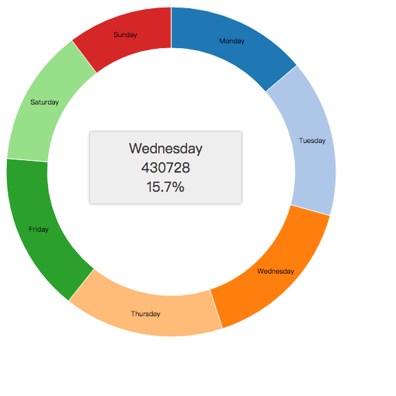

# reusable-donut-chart

Reusable donut chart is an API that allows you quickly and easily generate a donut chart. Donut chart has the ability to show the percentages of different features or elements of the dataset. Below is quick tutorial on how to use this reusable donut chart.

## Step 1 Clone the Repo and Setup
> Clone down this repo to your local machine. Once complete, create a new **index.html** file for showing the donut chart. In the **index.html**, include the necessary header and load in the donut chart script:

	
> and the css file in the repo:

	<link rel="stylesheet" href="css/main.css" />
> make sure to include script for d3 library as well:

	
> give a header and some description in the body of your index.html.

## Step 2 Read and Explore the DonutChart.js
> Before you start using this donut chart, take a look at the **DonutChart.js** file to get a better understand of this chart type. In order to draw a donut chart, we need to define an `arc` and a `pie`. For more information on what they are and how they work, check out this [link](https://github.com/d3/d3/blob/master/API.md#pies)

## Step 3 Find Dataset
> Find a dataset that you want to use a donut chart to showcase the data. You need at least two columns in the dataset, one is the category or identifier, the other is a number, or count of the specific category. Store the csv file inside the data folder.

## Step 4 Load and process data
> Now you are ready to create donut chart. First, include a new `
` inside the body of `index.html` and assign a `id` to it.
> Create a new file under the js folder and name it `main.js`. Don't forget to include it inside your `index.html`.
> Now load in the data using `d3.csv()`.
> Create a variable named `chartData` to hold the formatted data.
> Create a function named `prepData` to process the dataset you pass in. Use `.map` method to format the data:
	
	var prepData = function() {
        chartData = data.map(function(d) {
            return {
                id: d.X,
                count: d.Y
            };
        });
    }
> where **X** is the category column name in your dataset and **Y** is the count column name.

## Step 5 Create Donut Chart
> To create the donut chart, call `DonutChart()` to make a new chart instance.
> Now select the `
` element inside `index.html` to render the donut chart. Bind the data to the `
` using `.datum` call and pass in `chartData` we got from Step 4. And use **selection.call** to pass in the donut instance we created to render the chart.
	
	d3.select('#chart')
            .datum(chartData)
            .call(donut);
> If you did the above steps correctly, run your local host, you should be able to see a donut chart similar to the picture below.

## Step 6 Modify and Change the look of the Donut Chart
> Now you have a donut chart show up, you can use a couple methods to change the look of it.
> Take a look at chart methods inside `DonutChart.js`. There are total 10 methods that you can call to change the look of this donut chart. When using these calls, call them on the donut instance you created earlier and pass in a number value as the parameter in order to change the value of these properties.

> `height` and `width` allow you to adjust the size of the svg element that is rendering the chart

> `radius` controls both the outer and inner radius of the donut chart. Set `radius` to `70`, and you will get a pie chart. `cornerRadius` effectively dicates the gap between slices, try setting is to `3`. `padAngle` sets how rounded the corners are on each slice, the bigger the number, more rounded slices. Try `0.15` and `0.01` as the padAngle.

> `tooltipWidth`, `tooltipTop`, `tooltipPadding`, `tooltipLeft`, and `tooltipFont`, controls the setting of the tooltip that shows up when you hover over the donut chart. By calling this method, you can adjust the width of the tooltip box, the position of tooltip and the font size of the tooltip.

> You can perform these calls by doing:

	var donut = DonutChart().param1(value1).param2(value2);

> That's all, have fun playing with this simple donut chart!

